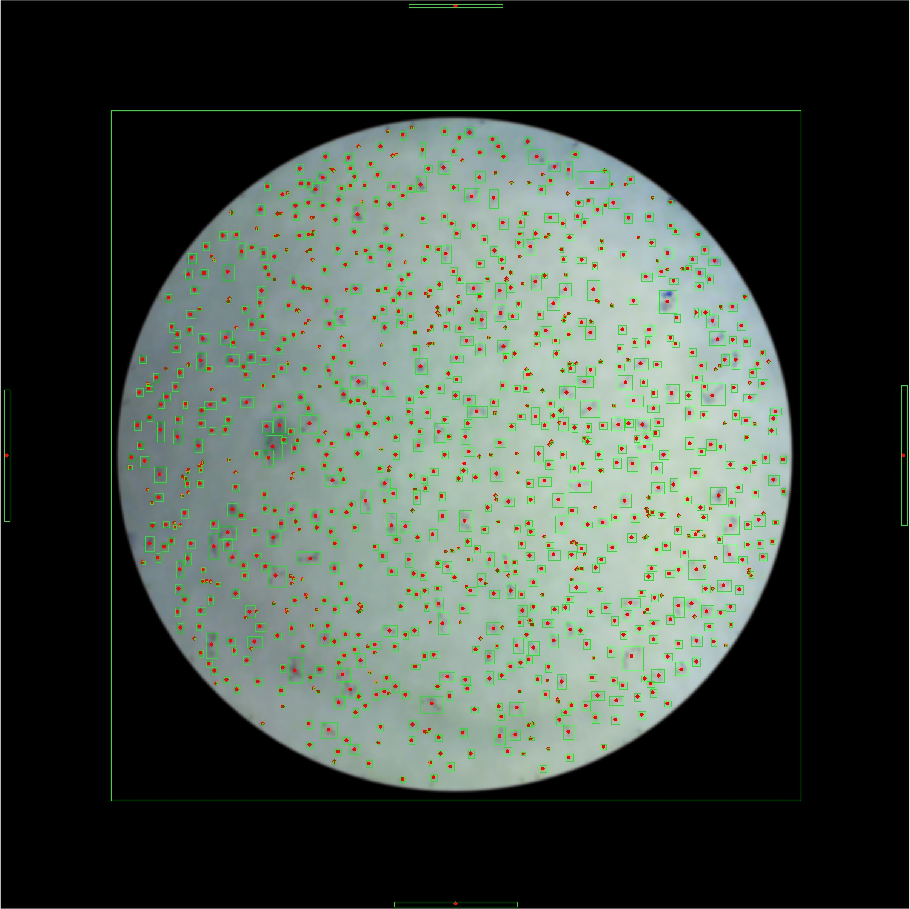

# 🔬 Contador de Ovos de *C. elegans* — Visão Computacional com Python

> Ferramenta de análise de imagem para contagem automatizada de ovos do nematódeo *Caenorhabditis elegans* usando visão computacional e processamento digital de imagens.

---

## 🧬 Sobre o Projeto e Contexto de Engenharia

Na indústria moderna e em laboratórios de biotecnologia, a inspeção visual manual é lenta, cansativa e altamente sujeita a erros humanos. Este projeto cria um sistema automatizado de controle de qualidade, medição e contagem usando **Visão Computacional** com OpenCV e Python.

O *Caenorhabditis elegans* é um organismo modelo amplamente utilizado em biologia celular, genética e ensaios farmacológicos. Este script processa uma imagem microscópica de amostra e retorna:
- O **número total de ovos detectados** com alta acurácia.
- Uma **imagem anotada** (`Resultado.jpg`) com caixas delimitadoras (*bounding boxes*) e centroides marcados em cada ovo para verificação visual imediata.

---

## ⚙️ Como Funciona o Pipeline de Processamento

O pipeline de processamento de imagem segue as seguintes etapas estruturadas:

1. **Leitura da imagem** (`Contar.jpg`)
2. **Conversão para escala de cinza**
3. **Equalização de Histograma Local (CLAHE):** Melhora substancialmente o contraste local da imagem.
4. **Binarização Adaptativa Gaussiana:** Em vez de usar um corte de brilho fixo para a imagem inteira, o algoritmo analisa pequenos blocos da foto. Isso compensa sombras causadas pela lente do microscópio ou iluminação desigual.
5. **Máscara circular:** Remove artefatos e ruídos indesejados localizados nas bordas da lente de captura.
6. **Operações Morfológicas (Erosão e Dilatação):** Removem pequenos ruídos espúrios na imagem (poeira ou sujeira da lâmina) e ajudam a "descolar" ovos que estejam encostados ou ligeiramente sobrepostos.
7. **Contagem por componentes conectados:** Mapeamento via `connectedComponentsWithStats` para rastrear tamanho e coordenadas.
8. **Visualização:** Exibição com Matplotlib comparando o Threshold gerado e os ovos identificados.

---

## 🛠️ Tecnologias e Justificativa Técnica

| Biblioteca | Papel | Justificativa |
|---|---|---|
| **OpenCV** (`cv2`) | Core de Visão Computacional | Biblioteca padrão industrial de altíssima performance para processamento de matrizes de imagens. |
| **NumPy** | Operações Matriciais de Alta Performance | Processamento matemático vetorizado executado por baixo dos panos em C, garantindo velocidade para análise em tempo real. |
| **Matplotlib** | Plot e Visualização | Ferramenta flexível para gerar o relatório gráfico e as janelas de comparação dos filtros. |

---

## 📊 Demonstração do Funcionamento

Abaixo está a imagem contendo o resultado da análise automática gerada pelo algoritmo:



---

## 🚀 Como Usar

### 1. Instalar dependências
```bash
pip install opencv-python numpy matplotlib
```

### 2. Preparar a imagem
Coloque a imagem microscópica a ser analisada na pasta do projeto com o nome `Contar.jpg`.

### 3. Executar o script
```bash
python Bublle.py
```

### 4. Saída
O script imprimirá no terminal:
```bash
✅ Quantidade de pontinhos encontrados: <N>
```
E salvará a imagem anotada como `Resultado.jpg` na pasta do projeto, além de exibir a comparação visual.

---

## 📁 Estrutura de Diretórios
```
Contador de OVOS de C. elegans - Python/
├── Bublle.py       # Script principal de processamento de visão computacional
├── Contar.jpg      # Imagem microscópica de entrada (amostra original)
└── Resultado.jpg   # Imagem gerada com as detecções e contagens anotadas
```

---

## 💡 Roteiro de Perguntas para Entrevistas (Conceitos Avançados)

* **P: O que fazer se a iluminação da amostra mudar completamente de uma captura para outra?**
  * **R:** Aplica-se o algoritmo **CLAHE (Contrast Limited Adaptive Histogram Equalization)** antes do thresholding. Ele adapta e equaliza o contraste localmente em pequenos blocos (tiles), mitigando a variação global de brilho sem estourar o ruído nas áreas escuras.
* **P: Como garantir que o processamento seja rápido o suficiente para rodar em tempo real em uma linha de produção ou fluxo contínuo?**
  * **R:** Reduzindo a resolução da imagem para o menor tamanho viável que preserve as características geométricas dos ovos, e tirando vantagem total das operações vetorizadas da biblioteca **NumPy** (que roda loops internos altamente otimizados em C), evitando ao máximo laços `for` em Python puro para varrer pixels.
* **P: Quais foram as maiores dificuldades no ajuste do pipeline?**
  * **R:** O ajuste fino dos hiperparâmetros (como o tamanho do bloco vizinho do `adaptiveThreshold` e a constante de subtração $C$). O maior desafio em Visão Computacional clássica é encontrar valores robustos que funcionem não apenas para uma imagem idealizada de laboratório, mas que tolerem pequenas sombras, fiapos e impurezas na lente.
